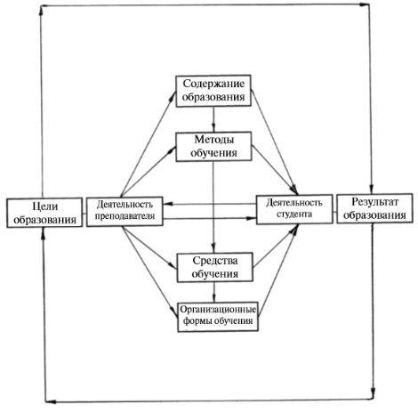
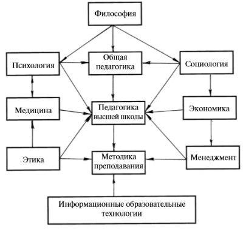

# 3. Структура и содержание дисциплины

### Структура 

Структура образовательного процесса включает: цели, содержание, методы, средства и формы организации обучения и воспитания студентов.

#### Образовательный процесс в вузе

Процесс формирования личности специалиста, начиная с выбора профессии, до защиты диплома. В деятельностном плане образовательный процесс – это совместная деятельность преподавателей и студентов, направленная на их обучение, воспитание и развитие.

### Содержание дисциплины

#### Общая педагогика

Раскрывает общие закономерности педагогического процесса, разрабатывает теоретические основы обучения и воспитания, методы их исследования, изучает вопросы управления образовательными системами. 

#### Общая психология 

Выступает базовой наукой по отношению к другим отраслям психологических знаний. Она включает методологию психологической науки, разрабатывает понятийный аппарат, раскрывает закономерности формирования и развития психических явлений, свойств и состояния, изучает сознание, речь, деятельность и личность человека.

##### Возрастная психология

Исследует закономерности формирования и развития психики человека начиная с рождения, затем в разные периоды жизни и деятельности.

#### Педагогическая психология 

Изучение психологических закономерностей обучения и воспитания человека. Например:

* формирование мышления;
* навыки интеллектуальной деятельности;
* взаимоотношения между преподом и учеником;
* отношения в коллективе и т.д.
