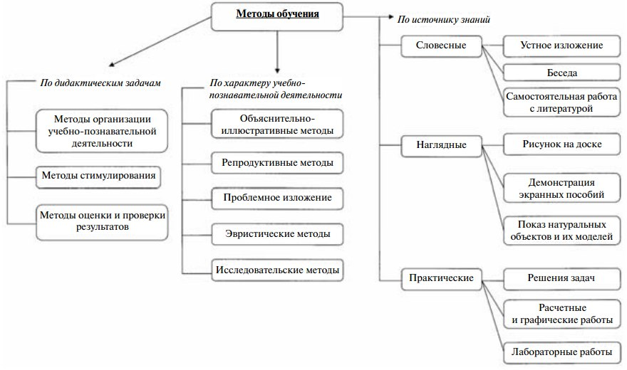

# 12. Классификация методов обучения. Традиционные методы обучения

На текущей момент не представлена общепринятая классификация методов обучения.  
Наибольшее распространение в педагогической литературе получили три направления в классификации методов обучения:

* по виду источников, из которых учащиеся приобретают знания и умения;
* по основным компонентам деятельности преподавателя;
* по уровню познавательной активности учащихся.

Традиционная система обучения состоит из следующих этапов (элементов):

* постановки преподавателем темы, раскрытия целей и задач обучения;
* изложения учебного материала, восприятия учащимися новых элементов знаний;
* организации закрепления материала, осмысления и запоминания обучаемыми новых знаний;
* формирования умений и навыков, применения знаний в решении теоретических и практических задач;
* проверки и оценки знаний, умений и навыков учащихся.

В качестве основного недостатка такой системы обучения можно привести пассивный характер познавательной деятельности обучаемых. Главная их задача заключается в том, чтобы запомнить то, что объяснил и показал преподаватель, а затем суметь воспроизвести (извлечь из памяти) изученную информацию. Познавательная деятельность учащихся при таком обучении опирается преимущественно на такие психические процессы, как восприятие, запоминание и воспроизводящее (репродуктивное) мышление.